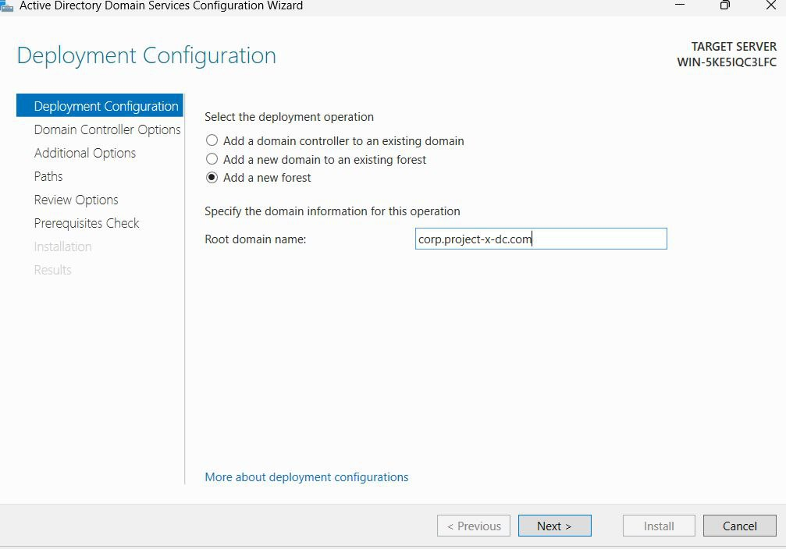
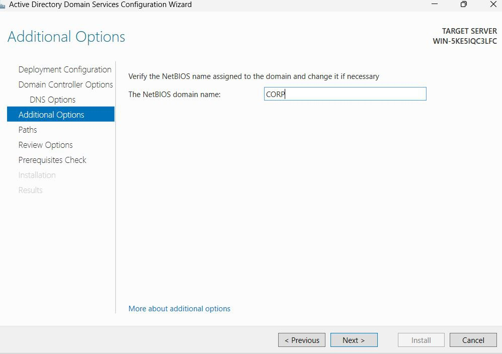
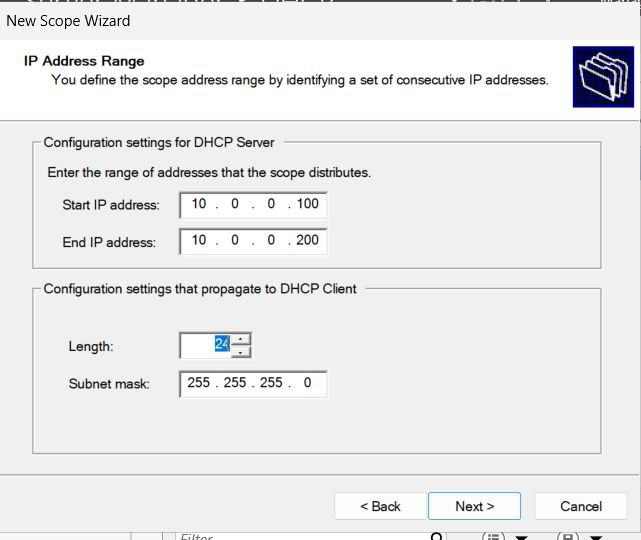
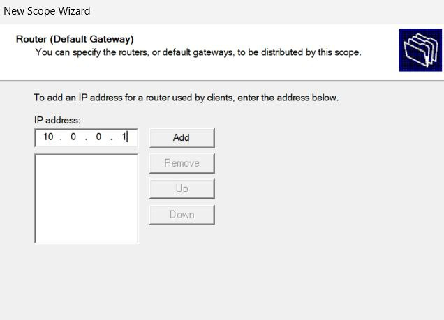
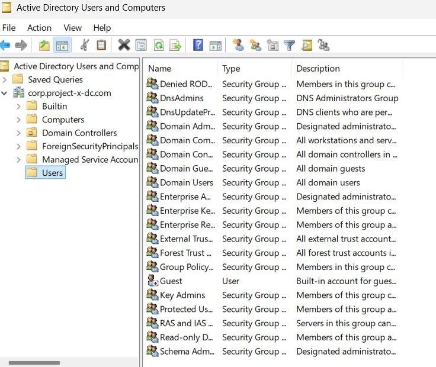

# 🖥️ Windows Server Setup – Project X Lab

---
## 🔧 Setup Details

### 🧱 VirtualBox NAT Network Configuration

- **Network Name:** `project-x-network`
- **IP Address Range:** `10.0.0.0/24`
- **DHCP Scope:** `10.0.0.100 – 10.0.0.200`
- **IPv6:** Disabled

> ✅ **Note:** An issue was initially caused by the Windows Server VM using the wrong NAT Network (`NAT Network` instead of `project-x-network`). Once corrected, DNS and internet access started working properly.

---

### 🖥️ Windows Server VM Configuration

- **Operating System:** Windows Server 2025
- **Static IP Address:** `10.0.0.5`
- **Subnet Mask:** `255.255.255.0`
- **Default Gateway:** `10.0.0.1`

---

### 🔌 Installed Roles and Features

Via **Server Manager** → *Add Roles and Features*:
- Active Directory Domain Services (AD DS)
- DNS Server
- DHCP Server
- File and Storage Services
- Web Server (IIS)

---

### 🧩 Active Directory Domain Services

- **Action:** Promoted server to Domain Controller
- **Domain Type:** New Forest
- **Root Domain Name:** `corp.project-x-dc.com`
- **NetBIOS Name:** `CORP`

---

### 🌐 DNS and Internet Connectivity

- Configured DNS Forwarders:
  - Added `8.8.8.8` in DNS Manager → Server → Properties → **Forwarders**
- Verified DNS and internet were **not working initially** due to network misconfiguration
- ✅ **Fixed** by properly attaching VM to `project-x-network`

---
## ✅ DHCP Server Setup

We configured a DHCP server to assign dynamic IPs in the internal network `10.0.0.0/24`.

### Steps:

1. **Open Server Manager**
   - Navigate to `Tools` → `DHCP`.

2. **Create a New Scope**
   - Expand `IPv4` → Right-click → `New Scope`.
   - Scope Name: `project-x-scope`

3. **Configure IP Address Range**
   - **Start IP Address**: `10.0.0.100`
   - **End IP Address**: `10.0.0.200`
   - **Subnet Mask**: `255.255.255.0`

4. **Router (Default Gateway)**
   - Add: `10.0.0.1`

5. **Leave Other Settings Default**
   - No DNS or WINS changes required.
   - Finish the wizard.

---

## 👤 Add User Accounts in Active Directory

Created users in the domain `corp.project-x-dc.com` using ADUC.

### Steps:

1. **Open Active Directory Users and Computers**
   - Navigate to `Server Manager` → `Tools` → `Active Directory Users and Computers`.

2. **Add a New User**
   - Right-click `Users` → `New` → `User`.
   - Example user:
     - **Name**: `John Doe`
     - **Username**: `johnd`

3. **Configure User Settings**
   - Check: `User cannot change password`
   - Set initial password as per project requirements (e.g. `@password123!`)
   - Leave other settings default.

4. **Finish**
   - User account successfully added.

---

